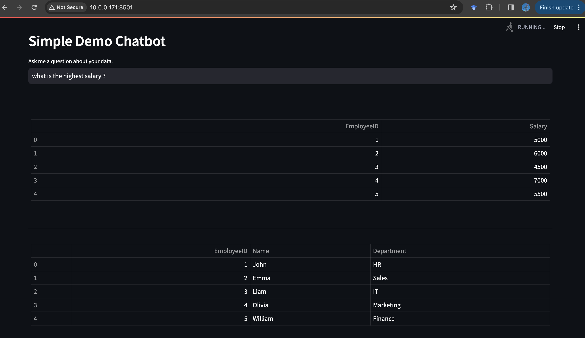

# llama2-csv-webapp

Show case running a couple of lines of code to 
- launch a web app
- with local hosted LLM, such as llama2, without exposing your data to external commercial products.
- chat about csv

I am trying to keep the code as simple / naive as possible to make it easy enough to read, instead of optimizing the robustness.

## Machine Requirements

The >= 24GB Memory GPUs (such as 3090ti, 4090, ...) is all you need. If your GPU memory is lower than that, just swap the local model with a smaller one.

Everything below is tested on a Ubuntu 22.04 machine, in the native system with Anaconda.

## Step by Step Guide

### Install Python Dedpendencies

`pip install -r requirements.txt`

### Spin Up Local LLM Inference Server

Follow [this](https://huggingface.co/docs/text-generation-inference/quicktour#quick-tour) or run the follows:

```
model=codellama/CodeLlama-7b-Instruct-hf
volume=$PWD/data
docker run --gpus all --shm-size 1g -p 8080:80 -v $volume:/data ghcr.io/huggingface/text-generation-inference:1.3 --model-id $model
```

(You can change `codellama/CodeLlama-7b-Instruct-hf` to smaller models if your GPU has low Memory)


### Spin Up Streamlit Web App

`streamlit run app.py`

Open `http://10.0.0.171:8501/` on your browser and you are all set!


